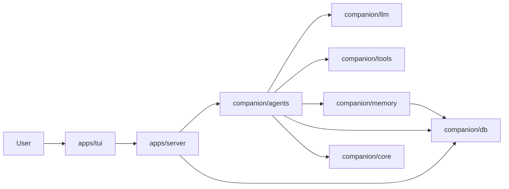
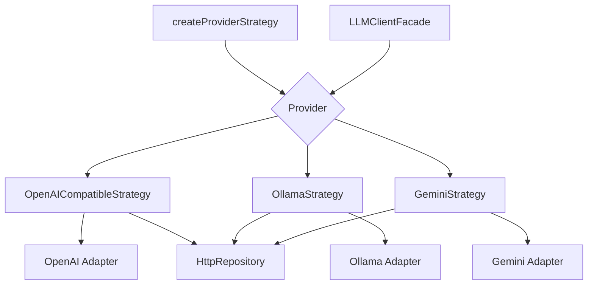
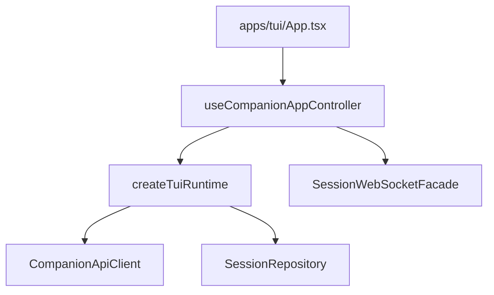

# Architecture Patterns

This document defines the enforced architecture approach across all packages and apps.

## Pattern Contract

Every major feature should map to these boundaries:

1. `Strategy`: selects behavior per provider/mode/runtime condition.
2. `Adapter`: converts payloads and protocol formats.
3. `Repository`: encapsulates persistence/network/store boundaries.
4. `Facade`: provides a stable app-facing API.
5. `Factory`: constructs and wires dependencies.

## Package Map

- `@companion/llm`: provider strategy + adapter + repository + facade + factory.
- `@companion/agents`: orchestration decision strategy + runner facade.
- `@companion/tools`: default tools factory + sandbox integration.
- `@companion/memory`: vector repository + context facade.
- `@companion/db`: driver strategy map + store repositories.
- `@companion/config`: override repository + config store facade.
- `@companion/core`: event bus facade + pluggable id generation strategy.
- `@companion/skills`: skill-tool definition factory + execution adapter.
- `apps/server`: service/repository splits; thin route/bootstrap layers.
- `apps/tui`: hook controller facade + websocket facade + runtime factory.

## Runtime Flow Diagram



## LLM Pattern Diagram



## App Pattern Diagram



## Quality Gates

Run all before merge:

```bash
bun run lint
bun run typecheck
bun run test
```

For package-level verification:

```bash
bun --cwd packages/agents run typecheck && bun --cwd packages/agents run test
bun --cwd packages/config run typecheck && bun --cwd packages/config run test
bun --cwd packages/core run typecheck && bun --cwd packages/core run test
bun --cwd packages/db run typecheck && bun --cwd packages/db run test
bun --cwd packages/llm run typecheck && bun --cwd packages/llm run test
bun --cwd packages/memory run typecheck && bun --cwd packages/memory run test
bun --cwd packages/skills run typecheck && bun --cwd packages/skills run test
bun --cwd packages/tools run typecheck && bun --cwd packages/tools run test
```
