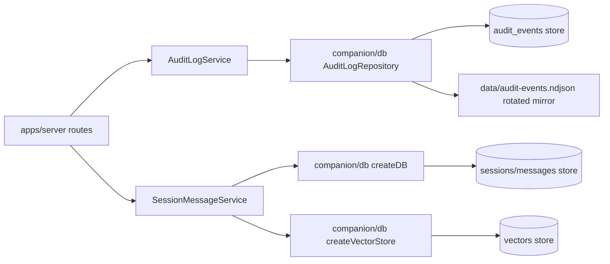
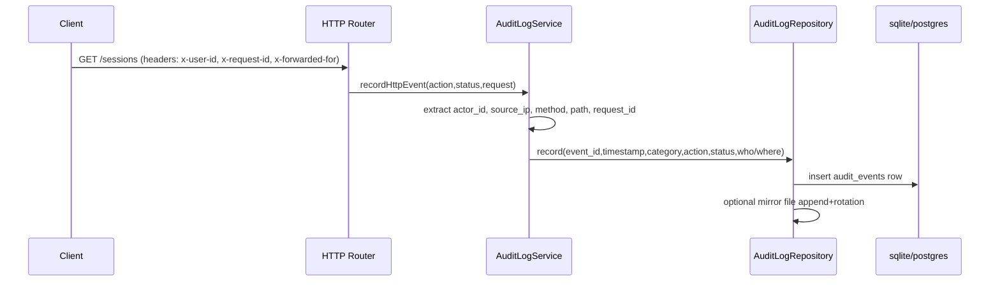
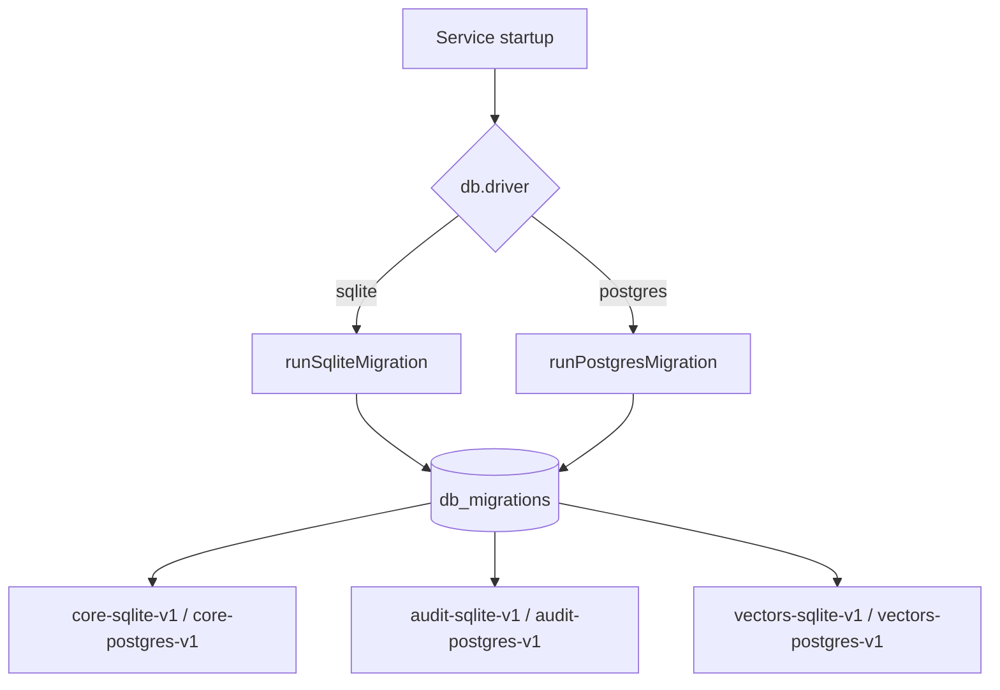

# Database Architecture

This document defines production persistence boundaries, audit lineage, and migration flow.

## Goals

- Keep all persistence I/O inside `packages/db`.
- Maintain driver parity for sqlite and postgres.
- Ensure audit records contain who/what/when/where context.
- Use explicit, versioned migrations for schema evolution.

## Runtime Boundary



## Audit Record Lineage



## Migration Flow



## Auditable Fields

Each `audit_events` row stores:

- `event_id`: stable event identifier
- `timestamp`: event time (UTC)
- `category`: domain category
- `action`: operation name
- `status`: result status
- `session_id`: related session
- `actor_id`: who initiated action
- `actor_type`: service/user/integration/system
- `source_ip`: origin address
- `request_id`: request correlation id
- `http_method`: request verb
- `http_path`: request route
- `user_agent`: caller fingerprint
- `metadata`: additional structured payload

## Operational Commands

```bash
bun run proof:db
bun run proof:db -- --strict
```

This proof validates DB CRUD, vector persistence, and audit who/where persistence using the configured driver.
